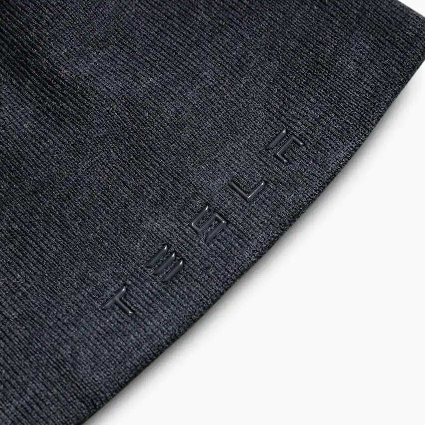

# Frontend TESLO-SHOP Ecommerce Online 🛍



[See the aplication](https://meru-ecommerce.vercel.app/) 👀

## Welcome! 👋

\*\* Frontend Technologies 🛠

# Next.js Teslo App

for run in local you need the local database

```
docker-compose up -d
```

- MongoDB URL Local:
  yarn install
  yarn dev

```
  mongodb://localhost:27017/teslodb
```

## fill the database for test with dummy data

```
  http://localhost:3000/api/seed
```

- HTML5
- CSS3
- JavaScript,
- React,
- Next,
- Context API
- Material

## Pre-requirements 📋

- Node
- Npm

## Run app " Development " ⚙️

```
1.- npm install or yarn install
2.- npm run dev or yarn dev  --Mode development
```

## Run app " Production " 🚀

```
1.- npm install or yarn install
2.- npm run build or yarn build
3.- npm run start or yarn start  --Mode production
```

## Deployment 📦

- [Vercel](https://vercel.com/) - Vercel

_Tools I've used in this project_

- [Npm](https://www.npmjs.com/) - Npm
- [React](https://es.reactjs.org/) - React
- [NextJs](https://nextjs.org/) - NextJs
- [Material](https://mui.com/) - Material UI

## Author ✒️

_Developed by_

- **Ismael JDz7** - _Frontend-Developer_ - [IsmaelJdz7](https://github.com/IsmaelJDz)

---

⌨️ with ❤️ by [IsmaelJDz7](https://github.com/IsmaelJDz) 😊
